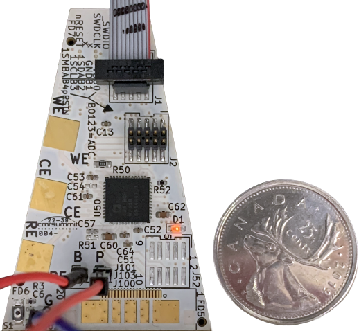

# SwiftMote-Electrochemical Sensor Platform

## Acknowledgement

The hardware and software of the SwiftMoteEC was developed by CMC Microsystems in collaboration with Dr. Phillippe Dauphin Ducharme and his team at Université de Sherbrooke’s Department of Chemistry and Abaxial Medical, as part of the Acuité Québec Consortium.

---

    

SwiftMote-Electrochemical Sensor Platform is a small, open, wireless (BLE) platform designed for electrochemical experiments that require free movement of the sensing platform.

The platform features:
- ST BlueNRG-LP Bluetooth Low Energy microcontroller
- 256kB flash memory
- 64-bit unique ID
- Expansion ports with 4x 12-bit ADC and I2C
- Analog Devices AD5941 potentiostat amplifer with 16-bit ADC and 12-bit DAC
- Host PC application to record and process square-wave voltammetry data

CMC has limited hardware samples available for demonstration and evaluation. Contact us for availability and pricing.

## Repository

This repo contains hardware design files and demonstration application software to manufacture the existing platform or modify it for specific user needs:
> /hardware : printed circuit board development and manufacturing of prototype hardware

> /software : demonstration application for Server (SwiftMoteEC) and Client (Windows PC)

## Support

CMC can assist, from answering technical enquiries, to helping with installation and setup, to providing consulting services to customize the platform for your needs. If you have questions:

* Submit an Issue in the repository
* CMC Subscribers: submit support questions through CMC's [Online Support Form](https://www.cmc.ca/support/)
* Contact [lab@cmc.ca](mailto:lab@cmc.ca) for further enquiries

## Additional Resources

[CMC SwiftMote Product Page](https://www.cmc.ca/swiftmote-iot-customizable-sensor-platform/)

For ST BlueNRG-LP:
* [Product information, documentation, and support](https://www.st.com/en/wireless-connectivity/bluenrg-lp.html)
* [Evaluation Tool Software](https://www.st.com/en/embedded-software/stsw-bnrglp-dk.html)

For Analog Devices AD5940/AD5941:
* [Product information, documentation, and support](https://www.analog.com/en/products/ad5940.html)
* [AD5940 Code Examples](https://github.com/analogdevicesinc/ad5940-examples)
