This README provides the following information:
- Description of the Demo Application
- Development Environment
- Hardware Setup
- Software Setup
- Running the Demo Application

The target audience of this README are IoT application developers using the SwiftMoteEC IoT Electrochemical Sensor Platform (referred to as *the mote* subsequently in this document).

# Description of the Demo Application

This application demonstrates the basic functions of the mote acting as a data Server by:
- Reading sensor data from a dummy sensor using the Analog Devices' AD5941 analog front end (AFE)
- Interrupting the BlueNRG-LP microcontroller when sensor data is available
- Sending data over Bluetooth Low Energy (BLE) link to a Client computer
- Receiving and saving the data on the Client

The Server software running on the mote is responsible for interacting with the AD5941 device as well as establishing a connection and communicating with the client application running on a computer. The Server software uses the square-wave voltammetry method to measure data (current) generated on a dummy sensor board connected to the mote and transmits the data to the client via Bluetooth Low Energy protocol. The Server application runs on the ST BlueNRG-LP BLE microcontroller on the mote.

The Client software receives the data from the mote over the air, processes it, and then stores it in a file.  
Refer to the following two diagrams for detailed communication and control flow of the demo application:

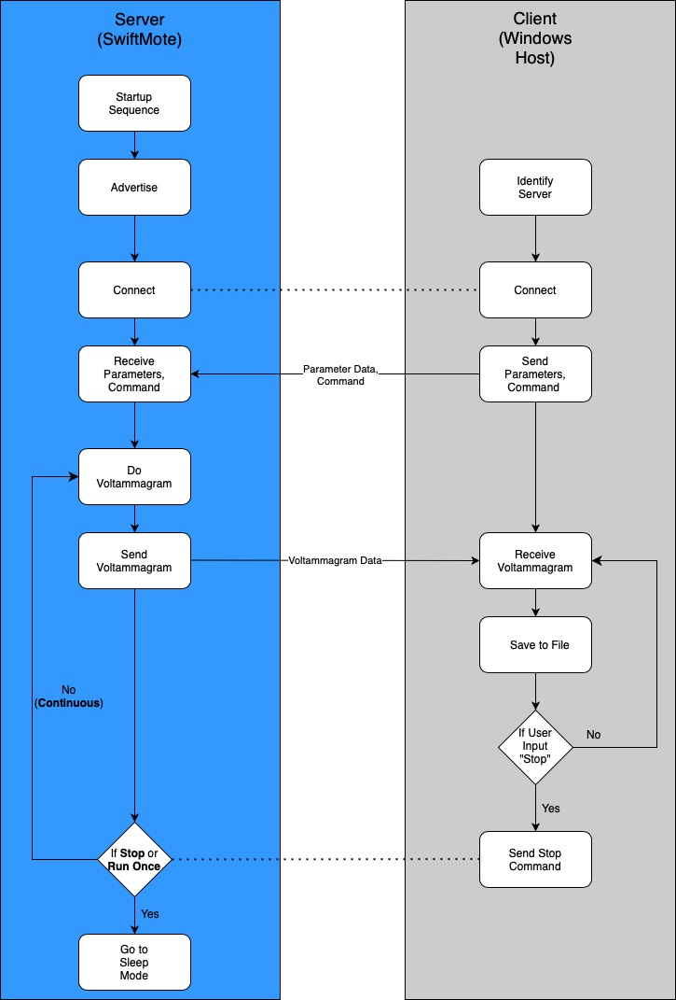

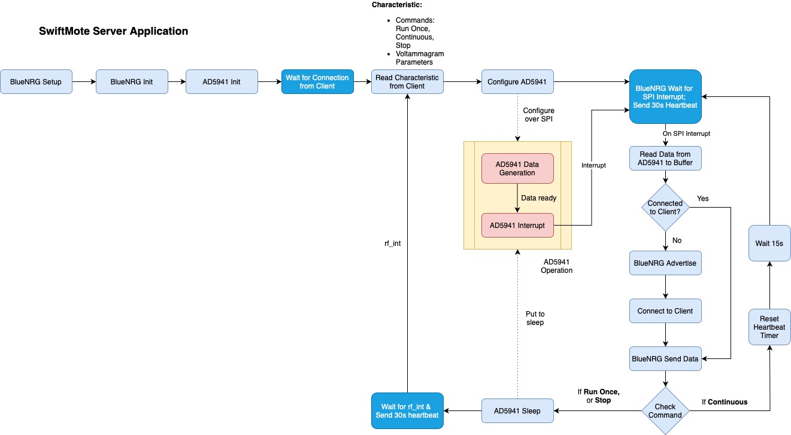

Figure 1: Server/Client Application &nbsp; &nbsp; &nbsp; &nbsp; &nbsp; &nbsp; &nbsp; &nbsp; &nbsp; &nbsp; &nbsp; &nbsp; Figure 2: Server (mote) Application Flow

# Development Environment
## Hardware Required
- A computer (Client)
- SwiftMoteEC (Server)
- Power supply to provide 3V to the mote. A Digilent Analog Discovery device is used in the demo.
- Debugger probe for programming the mote. Segger J-link is used in the demo.

  *Note: for academic use, Segger J-Link mini - EDU edition, is available.*
- Two 500 Ohm resistors (used to create a dummy sensor)
- A bread board and some jumper wires to make connections between the hardware components
## Software Required
- Windows 10
- [Python 3.9 or later](https://www.python.org/downloads/)
- Pycharm 2022.1.2 or later, [Pycharm Community Edition](https://www.jetbrains.com/pycharm/download/?source=google&medium=cpc&campaign=14127625109&term=pycharm&gclid=Cj0KCQjwxveXBhDDARIsAI0Q0x16fXFz4C-7_MGVG-Yv5K3o9jl235fJAqfMMMbFg_4_uuu_0xRi96caAi2OEALw_wcB#section=windows)
- [Bleak](https://github.com/hbldh/bleak) (0.20.2 or later); to install Bleak, in Window 10 Command Prompt, issue the following command : *pip install bleak*
- [Keil µVision V5.37 or later](https://www2.keil.com/stmicroelectronics-stm32) or later
- [Digilent WaveForms](https://digilent.com/reference/software/waveforms/waveforms-3/previous-versions) (if using Digilent Analog Discovery as power supply)
- [ST BlueNRG-LP_LPS DK 1.5.0 or later](https://www.st.com/en/embedded-software/stsw-bnrglp-dk.html#get-software)
- [SwiftMoteEC demo application](https://github.com/cmcmicrosystems/SwiftMoteECp_SW)

# Hardware Setup
In the demo, the hardware components as shown in the Figure 3 below include:
- A mote
- A debugger used to load the application firmware image into flash memory
- A power supply to provide 3V power to both the BlueNRG-LP and the AD5941 module.
- A dummy sensor consisting of two 500 Ohm resistors in series

  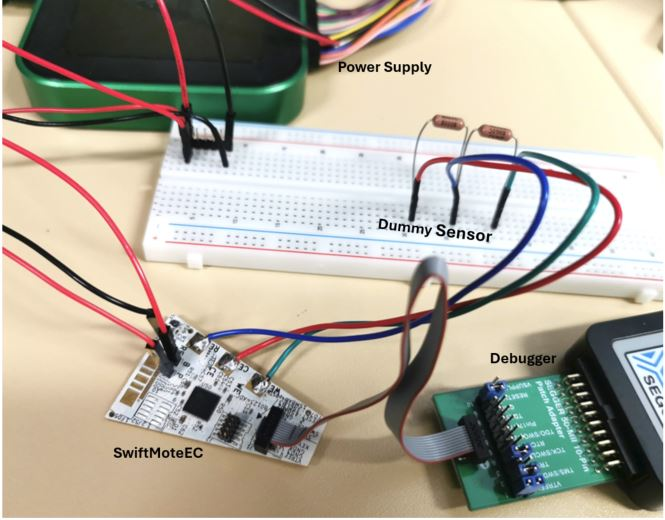 
Figure 3: Demo Hardware Setup

## Connections on the mote:

See Figure 4 below:
-	Connect your debugger to the *JTAG/SWD* connector on the mote. In the demo, a Segger J-LINK debugger is used. A J-LINK Mini EDU is also compatible.
-	Connect 3V power to the BlueNRG-LP power pin *B* on the mote
-	Connect 3V power to the AD5941 power pin *P* on the mote
-	Connect the ground of the power supply to the ground pin *G* on the mote
-	Connect the resistors to the *WE*, *CE*, and *RE* metal pads on the mote, respectively, as shown in the picture below.

  

  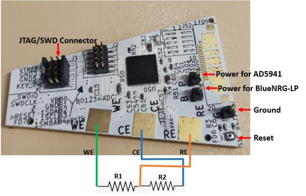
  

Figure 4: SwiftMoteEC Demo Connections

# Software setup
## Client Demo Application
1.	Copy the SwiftMoteEC_Demo_Client folder to your selected location.
2.	Open Pycharm and from the File menu, select "New Project...". A New Project window will appear (Figure 5). When you have filled out the details, click "Create".

   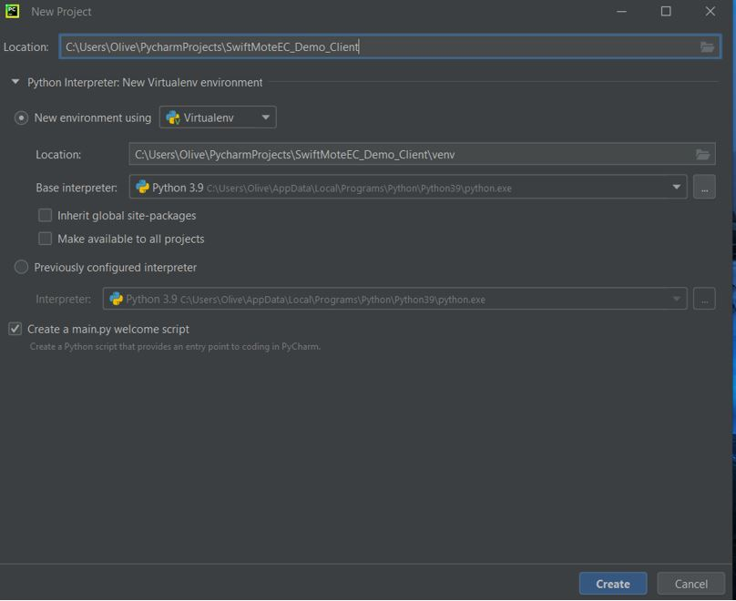 
   Figure 5: Pycharm New Project Window

3.	From the resulting pop-up window (Figure 6), select "Create from Existing Sources".

  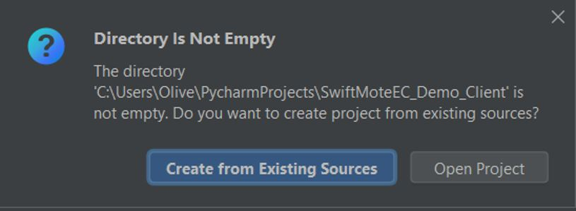 
  Figure 6: Pycharm Create Project Pop-up

4.	You should get a project view similar to Figure 7 below:

  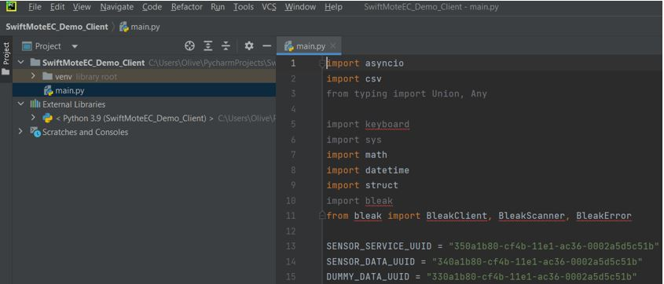 
Figure 7: Pycharm Project Window

5.	In the menu, select Run | Edit Configurations… | Add new run configuration… | Python  
6. Make sure:

  \- “Script path” is set to where the folder SwiftMoteEC_Demo_Client is and select the main.py

  \- “Python interpreter” is set automatically

  \- Working directory is set automatically once you have set Script path.
  An example is shown in Figure 8 below:

  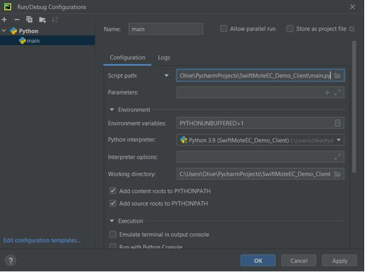  
  Figure 8: Pycharm Run/Debug Configurations Window

7.	From the project window on the left side of the Pycharm IDE, go to External Libraries | Python 3.9 | Lib | site-packages and verify the following libraries are there :bleak, bleak_winrt

## Server Demo Application

1.	Copy the SwiftMoteEC_Demo_Server to  ..\BlueNRG-LP_LPS DK 1.5.0\Projects\BLE_Examples 
2.	Copy all the .h files located in SwiftMoteEC_Demo_Server\other folder to ..\ BlueNRG-LP_LPS DK 1.5.0\Drivers\BSP\Inc
3.	Copy all the .c files located in SwiftMoteEC_Demo_Server\other folder to ..\ BlueNRG-LP_LPS DK 1.5.0\\Drivers\BSP\Src
4.	Open Keil µVision.
5.	From the menu, open the project by selecting Project | Open Project, browser to ..\BlueNRG-LP_LPS DK 1.5.0\Projects\BLE_Examples\SwiftMoteEC_Demo_Server\MDK-ARM\, and select the project file SwiftMoteEC_Demo.uvprojx.
6.	From the menu, select Project | Options for Target 'Release'.
7.	Verify the following:  
 a). In the Device tab (Figure 9), verify “BlueNRG-355” is selected

​
  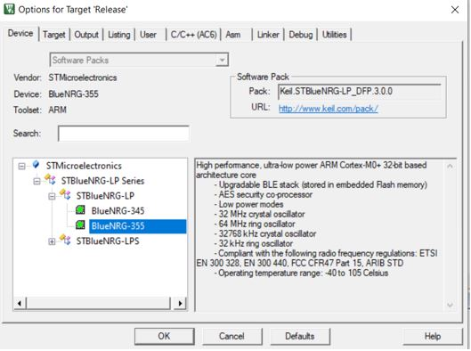  
  Figure 9

​	 b). In the C/C++(AC6) tab, verify you have the same setting as shown in Figure 10 below:

  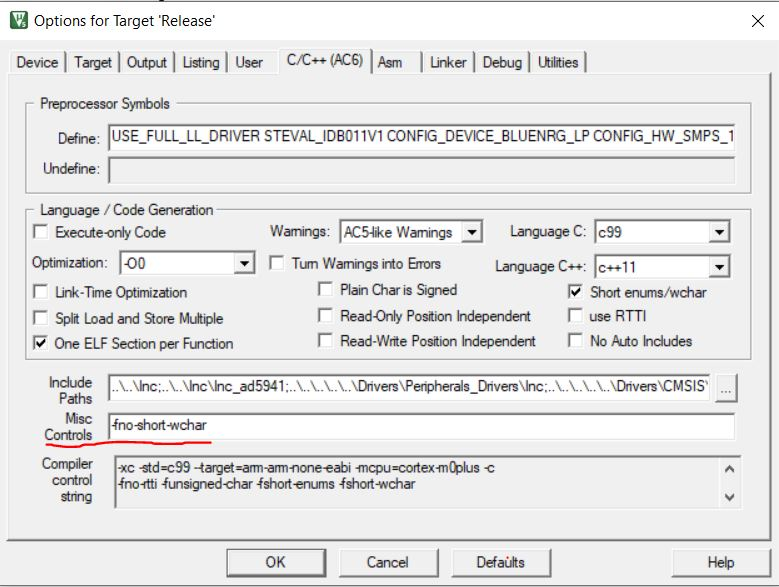     
  Figure 10

​	 c).In the Target tab (Figure 11), verify the ARM compiler is set to “Use default compiler version 6”

​		  
  Figure 11

​	 d). In the Debug tab (Figure 12), verify “J-link” is selected if you are using a J-Link debugger

​		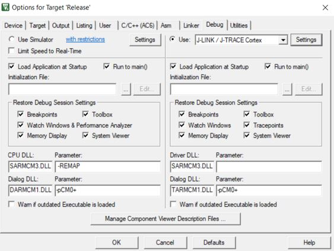 
Figure 12

​	 e). Click on “Settings” beside the selected debugger. If the mote is powered on and the J-link debugger is connected, you should see similar settings as shown in Figure 13:

​		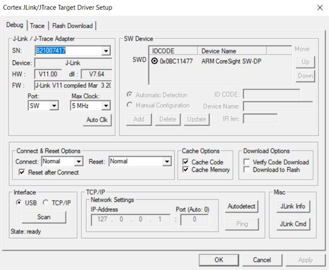 
Figure 13

8.	Click OK to close the window and go back to the Keil IDE project window.
9.	From the menu, select Project | Build Target, the project should compile successfully.
10.	With the J-link debugger connected and power supplied to the mote, program the mote by clicking the “LOAD” icon in the tool bar of Keil IDE.

# Running the Demo Application
Follow the steps below to test the demo application:

a). Supply 3V power to the mote.

b). Program the mote as instructed in the previous section if it has not been done yet.

c). Reset the mote by pressing the reset button.  

d). In Pycharm, select Run | Run main

e). In the Run console of Pycharm, issue one of the following commands:
- 'r' for run once
- 'c' for continuous run
- 's' for stop the continuous run

You should see similar output from the Pycharm terminal as shown in the Figure 14 below:

  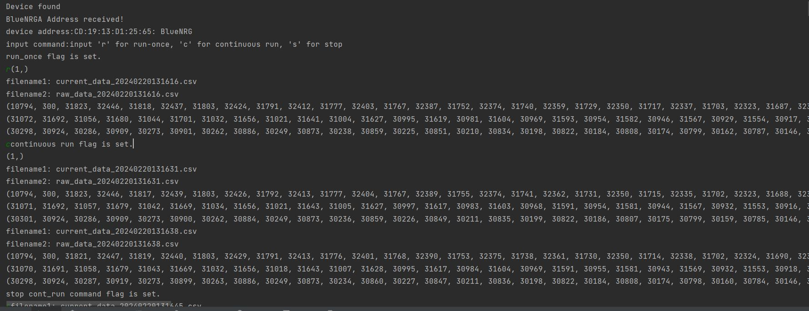 
Figure 14: Pycharm Output Window for Demo Application

f). In the Pycharm project directory …\PycharmProjects\SwiftMoteEC_Demo_Client\, you should see two .csv files are created.  One contains the raw data transmitted from the mote and the other one contains the current calculated based on the raw data received.
